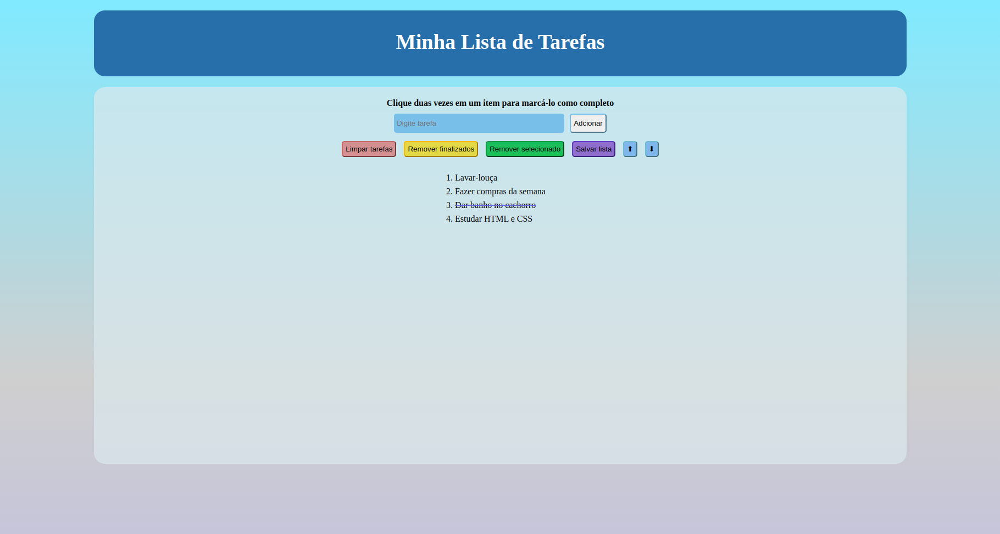

## **Bem-vindo ao repositório do projeto Todo List!**

### Screenshots

### Contexto
No projeto Todo List foi desenvolvido uma aplicação de lista de tarefas, podendo adicionar diferentes tasks e reordenar por prioridades, selecionar uma tarefa, marcar como finalizada, assim como remover ou salvar a sua lista.

### Tecnologias utilizadas
Projeto desenvolvido utilizando HTML 5, CSS3 e Javascript.

### Link do Deploy
<a href="https://todo-list-miyukishii.netlify.app/">Clique aqui</a>

##### Observações:
###### Este projeto foi requisitado pela Trybe ao longo da formação do curso de Desenvolvimento Web, para avaliação do conhecimento adquirido nos módulos de Fundamentos.
